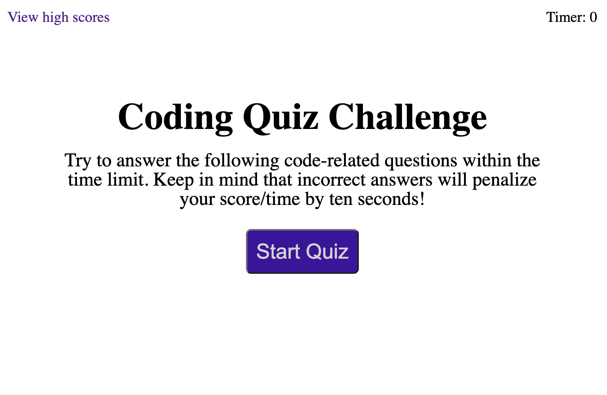
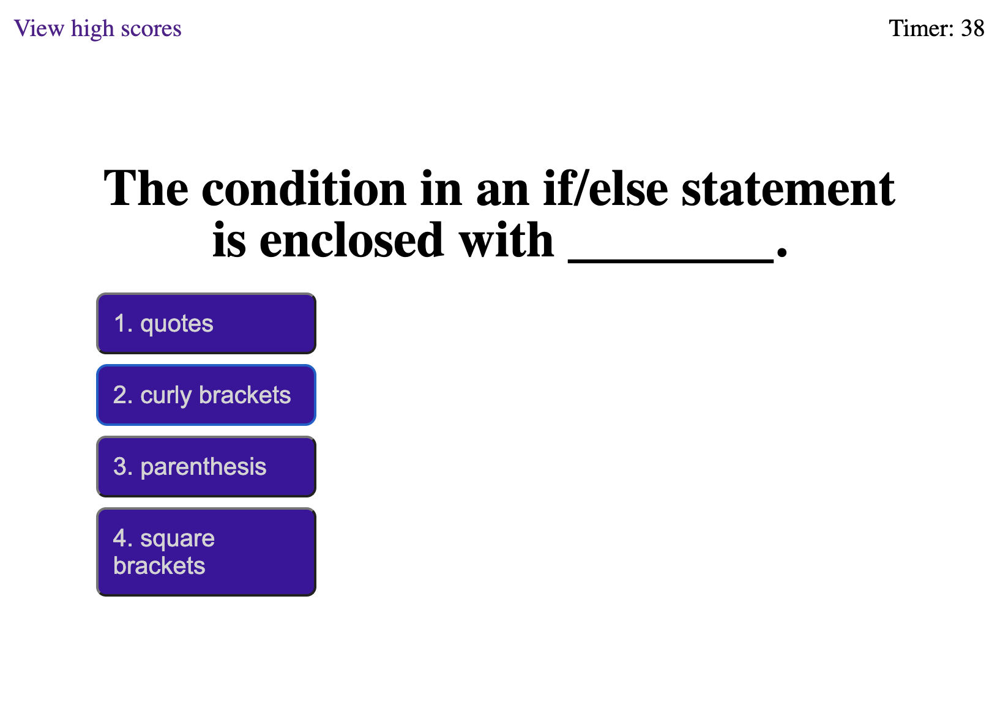
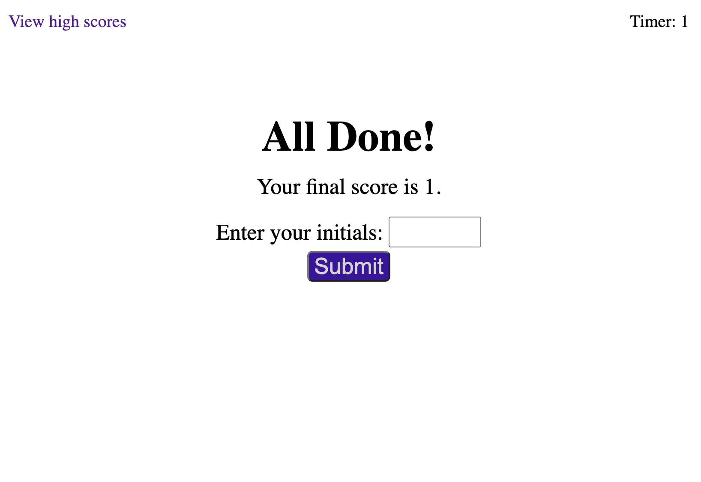

# Coding Quiz #

## Objective ##

>I built this project in order to practice working with Web APIs. I focused on DOM queries, timing events on the window object, and localStorage. This challenge was done from scratch without any starter code. The application works well enough that if I expanded the questions array I could use it as a study aid. :)

## Challenges

The most challenging features of the project were the timing events. These seemed simple enough but would occasionally either terminate or not terminate unexpectedly. Eventually I debugged the setInterval calls but I am still seeing some buggy behavior from the setTimeout calls. If I have time to come back to my beloved Coding-Quiz, I will refine these for a smoother UI.

## Built with:

* HTML
* CSS
* Javascript

## Website:

[Visit the site on Github Pages.](https://jonprice0.github.io/Coding-Quiz/)

## Here are screenshots of the finished page:

## License

> Naturally, I have not included a license for this simple exercise. :)

## Contributions:

>Made with ❤️ by Jonathan Price